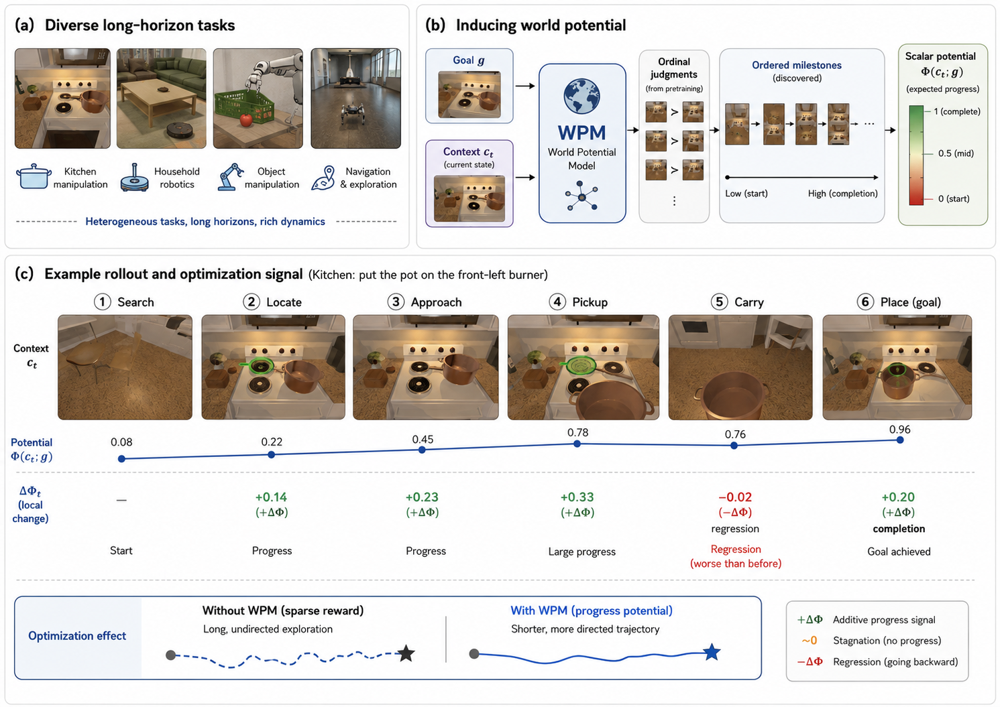
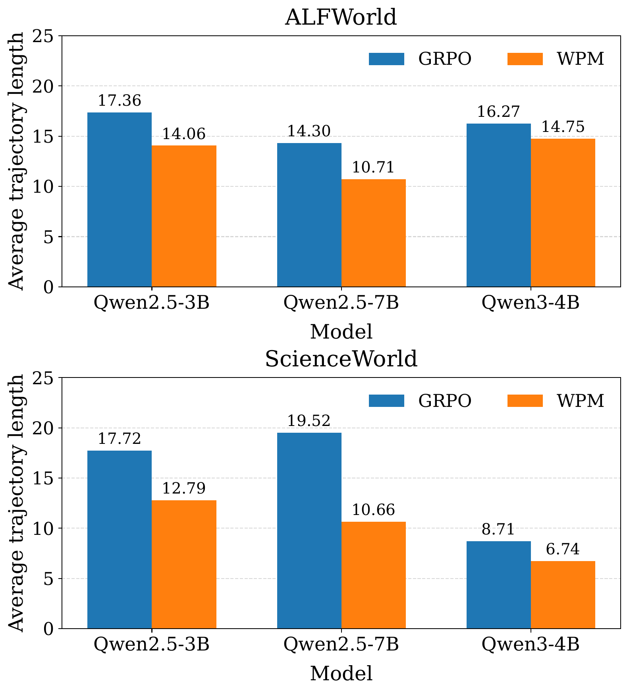

<div align="center">

<h1>World Potential Model</h1>
<h3>Pretrained World Knowledge as Progress Potentials</h3>
<p><strong>Official code release for progress-aware training of long-horizon language agents</strong></p>

<p>
  <a href="https://github.com/Gabrile166/agent-verl/tree/release"></a>
  <a href="LICENSE"></a>
  <a href="#quick-start"></a>
  <a href="#results"></a>
</p>

<p>
  <a href="#what-is-a-world-potential-model">Overview</a> ·
  <a href="#results">Results</a> ·
  <a href="#quick-start">Quick Start</a> ·
  <a href="examples/RELEASE_REPRODUCTION.md">Reproduction Guide</a> ·
  <a href="#citation">Citation</a>
</p>

<p><strong>Jun Zhao*</strong>, <strong>Jixin Tang*</strong>, Yang Shu, Jinyang Wu, Yuyang Lu, Jingqi Tong, Qi Zhang, Xuanjing Huang<br>
Fudan University · Tsinghua University · *Equal contribution</p>

</div>

<p align="center">
  
</p>

## What is a World Potential Model?

Long-horizon agents usually learn from sparse terminal outcomes: a trajectory is rewarded when the task is complete, but the learner receives little information about which intermediate actions made progress, stalled, or moved backward.

A **World Potential Model (WPM)** reuses pretrained world knowledge to evaluate the goal-relevant progress already realized in an agent context. Unlike a value function, a WPM is retrospective rather than predictive: it asks *how much of the task has been accomplished so far?*

Our paper studies two questions:

1. **Existence:** can off-the-shelf pretrained models recover meaningful progress structure without task-specific evaluator fine-tuning?
2. **Utility:** can these imperfect progress estimates provide useful supervision for long-horizon policy optimization?

In controlled experiments on **ALFWorld** and **ScienceWorld**, pretrained models recover relative progress substantially above chance. A milestone-anchored WPM then turns those judgments into step-level credit, improving success over outcome-only GRPO in every evaluated configuration while reducing interaction length.

## Highlights

| Progress from pretrained knowledge | Process-sensitive credit | Matched empirical gains |
|---|---|---|
| WPMs compare contexts and locate them on task-specific progress anchors without evaluator fine-tuning. | Temporal changes in world potential distinguish progress, stagnation, and regression within a trajectory. | Across six actor-environment comparisons, WPM improves success by **5.08 points on average** and shortens trajectories in all six. |

## Method at a Glance

For a task goal $g$ and agent context $x_t$, the WPM induces a task-relative potential $\Phi_g(x_t)$:

1. Generate or provide an ordered set of task-specific milestones.
2. Use a frozen pretrained model to compare the current context with those progress anchors.
3. Convert the ordinal judgment into a scalar, task-local world potential.
4. Use the temporal potential difference as a dense transition signal:

$$
r_t^{\mathrm{WP}} = \bar r_t + \gamma \Phi_g(x_{t+1}) - \Phi_g(x_t).
$$

5. Compute process-sensitive, step-level group-relative advantages and retain the clipped policy optimization pipeline used by GRPO.

The released `milestone_gae` implementation is the milestone-anchored WPM instantiation used in the policy-optimization experiments.

## Results

### Pretrained models expose progress structure

Across seven evaluated language and vision-language models:

- Mean pairwise progress accuracy is **92.52%**, compared with a 50% random baseline.
- Mean milestone localization accuracy is **74.71%**, far above the per-environment random baselines (20.00% on ALFWorld and 15.27% on ScienceWorld).
- The best evaluated model reaches **90.33%** average accuracy across both tasks and environments.

These capability results use environment-grounded labels only for evaluation; the labels are not given to the WPM.

### WPM-guided optimization improves task success

Success rate (%) under matched actor-training configurations:

| Actor policy | ALFWorld GRPO | ALFWorld WPM | ScienceWorld GRPO | ScienceWorld WPM |
|---|---:|---:|---:|---:|
| Qwen2.5-3B | 53.90 | **60.50** | 51.56 | **55.39** |
| Qwen2.5-7B | 68.70 | **72.10** | 66.40 | **74.73** |
| Qwen3-4B | 48.43 | **53.64** | 42.96 | **46.09** |

<p align="center">
  
</p>

<p align="center"><em>Average evaluation trajectory length in environment actions. Lower is better; WPM reduces interaction length in all six matched comparisons.</em></p>

## Quick Start

The release targets Linux machines with NVIDIA GPUs. Python 3.12 is recommended; ScienceWorld additionally requires Java 8 or newer.

### 1. Install

```bash
git clone https://github.com/Gabrile166/agent-verl.git
cd agent-verl

conda create -n wpm python=3.12 -y
conda activate wpm

pip install vllm==0.11.0
pip install flash-attn==2.7.4.post1 --no-build-isolation --no-cache-dir
pip install -e .
```

Install the environment you want to run:

<details>
<summary><strong>ALFWorld</strong></summary>

```bash
pip install gymnasium==0.29.1 stable-baselines3==2.6.0 alfworld
alfworld-download -f
export ALFWORLD_DATA=$HOME/.cache/alfworld
```

</details>

<details>
<summary><strong>ScienceWorld</strong></summary>

```bash
cd agent_system/environments/env_package/sciworld/ScienceWorld
pip install -e .
cd -
```

</details>

### 2. Prepare rollout queries

```bash
python3 -m examples.data_preprocess.prepare \
  --mode text \
  --local_dir ./data/verl-agent \
  --train_data_size 16 \
  --val_data_size 128
```

### 3. Run a baseline

```bash
# ALFWorld, outcome-only GRPO
MODEL_PATH=Qwen/Qwen2.5-7B-Instruct \
ALFWORLD_DATA=$HOME/.cache/alfworld \
bash examples/grpo_trainer/run_alfworld.sh
```

For ScienceWorld, use `examples/grpo_trainer/run_sciworld.sh`. The public GRPO scripts use `seed=42` by default.

### 4. Run WPM-guided optimization

Start two OpenAI-compatible judge/generator endpoints:

```bash
# Terminal 1
python -m vllm.entrypoints.openai.api_server \
  --model Qwen/Qwen3-VL-32B-Thinking-FP8 \
  --served-model-name wpm-judge \
  --port 8080

# Terminal 2
python -m vllm.entrypoints.openai.api_server \
  --model Qwen/Qwen3-VL-32B-Thinking-FP8 \
  --served-model-name wpm-judge \
  --port 8081
```

Then launch the milestone-anchored WPM training job:

```bash
MODEL_PATH=Qwen/Qwen2.5-7B-Instruct \
ALFWORLD_DATA=$HOME/.cache/alfworld \
JUDGE_LLM_URL_1=http://127.0.0.1:8080/v1 \
JUDGE_LLM_URL_2=http://127.0.0.1:8081/v1 \
JUDGE_LLM_MODEL=wpm-judge \
bash examples/milestone_gae_trainer/run_alfworld.sh
```

All entry scripts accept environment variables and trailing Hydra overrides. See the [full reproduction guide](examples/RELEASE_REPRODUCTION.md) for Qwen2.5-3B, Qwen3-4B, ScienceWorld, multi-node settings, judge configuration, and low-resource smoke tests.

## Released Entry Points

| Method | Environment | Entry point |
|---|---|---|
| Outcome-only GRPO | ALFWorld | `examples/grpo_trainer/run_alfworld.sh` |
| Outcome-only GRPO | ScienceWorld | `examples/grpo_trainer/run_sciworld.sh` |
| WPM (milestone anchored) | ALFWorld | `examples/milestone_gae_trainer/run_alfworld.sh` |
| WPM (milestone anchored) | ScienceWorld | `examples/milestone_gae_trainer/run_sciworld.sh` |

Useful shared overrides include `MODEL_PATH`, `DATA_DIR`, `EXP_NAME`, `TRAIN_BATCH_SIZE`, `VAL_BATCH_SIZE`, `GROUP_SIZE`, `NUM_GPUS_PER_NODE`, `TRAINER_LOGGER`, and `MY_TEMP_DIR`.

## Repository Map

| Path | Purpose |
|---|---|
| `rlvmr/core_milestone_gae.py` | Core milestone-anchored world-potential advantage computation |
| `rlvmr/milestone/` | Milestone generator and frozen judge clients |
| `examples/grpo_trainer/` | Matched outcome-only GRPO baselines |
| `examples/milestone_gae_trainer/` | WPM-guided ALFWorld and ScienceWorld experiments |
| `examples/RELEASE_REPRODUCTION.md` | Complete release and reproduction notes |
| `examples/doc/milestone_gae_algorithm.md` | Algorithm and implementation details |
| `agent_system/environments/` | Long-horizon environment integration |

## Citation

The public paper link and archival citation will be added when available. For now, please use:

```bibtex
@misc{zhao2026worldpotential,
  title  = {World Potential Model: Pretrained World Knowledge as Progress Potentials},
  author = {Jun Zhao and Jixin Tang and Yang Shu and Jinyang Wu and Yuyang Lu and Jingqi Tong and Qi Zhang and Xuanjing Huang},
  year   = {2026},
  note   = {Preprint}
}
```

## Acknowledgements

This project builds on [verl-agent](https://github.com/langfengQ/verl-agent) and [veRL](https://github.com/volcengine/verl). The released environments are adapted from [ALFWorld](https://github.com/alfworld/alfworld) and [ScienceWorld](https://github.com/allenai/ScienceWorld). We thank their authors and contributors for making this research possible.
