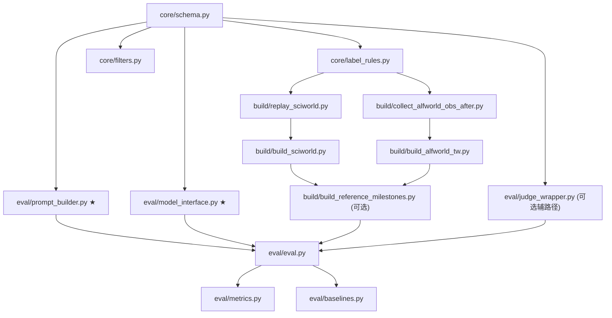

# Pairwise Potential Ranking Benchmark — 详细编码实现计划

> 本计划基于对以下源码的完整审阅：
> - `agent_system/environments/env_package/sciworld/envs.py` — SciWorld 多进程环境封装
> - `agent_system/environments/env_package/sciworld/ScienceWorld/scienceworld/scienceworld.py` — ScienceWorld Python API
> - `agent_system/environments/env_package/alfworld/envs.py` — ALFWorld Ray 环境封装
> - `agent_system/environments/env_manager.py` — 环境管理器（含 Expert 轨迹收集逻辑）
> - `rlvmr/milestone/judge.py` — MilestoneJudge（LLM 多 URL 负载均衡）
> - `rlvmr/milestone/generator.py` — MilestoneGenerator（动态里程碑生成）
> - `rlvmr/core_milestone_gae.py` — 核心 GAE 算法
> - `rlvmr/pipeline_data.py` — PipelineData 两级数据模型
> - `rlvmr/expert_trajectory.py` — 专家轨迹生成器接口

---

## 一、总体架构概览

```
benchmarks/pairwise_phi_ranking/
├── core/                              # 核心数据模型与公共工具
│   ├── __init__.py
│   ├── schema.py                      # 数据模型（dataclass）
│   ├── label_rules.py                 # 标签判定规则引擎
│   └── filters.py                     # 过滤与难度分桶
├── build/                             # 数据集构造 pipeline
│   ├── __init__.py
│   ├── replay_sciworld.py             # SciWorld 环境重放引擎
│   ├── build_sciworld.py              # SciWorld 样本构造主流程
│   ├── collect_alfworld_obs_after.py  # ALFWorld obs_after 独立采集
│   ├── build_alfworld_tw.py           # ALFWorld TW 样本构造主流程
│   ├── build_reference_milestones.py  # Companion milestone 生成（可选）
│   └── run_build_all.py               # 一键构造入口
├── eval/                              # 评测 pipeline
│   ├── __init__.py
│   ├── prompt_builder.py              # ★ Query 构建 + 响应解析（核心）
│   ├── model_interface.py             # ★ 被测模型统一接入层
│   ├── eval.py                        # 评测主流程
│   ├── metrics.py                     # 指标计算
│   ├── baselines.py                   # Baseline 实现
│   └── judge_wrapper.py               # [可选] pointwise phi 辅指标用
├── sciworld_exact/                    # Track 输出目录
│   ├── README.md
│   ├── dev.jsonl
│   ├── test.jsonl
│   ├── metadata.json
│   └── reference_milestones.jsonl
├── alfworld_tw_constructed/           # Track 输出目录
│   ├── README.md
│   ├── dev.jsonl
│   ├── test.jsonl
│   ├── metadata.json
│   └── reference_milestones.jsonl
└── results/
    └── leaderboard.md
```


---

## 二、Module 1：核心数据模型 (`core/schema.py`)

### 2.1 设计目标

定义全部 benchmark 数据结构为 Python dataclass，支持序列化到 JSONL。与现有 `rlvmr/pipeline_data.py` 的设计风格保持一致（typed dataclass + dict 序列化），但**完全独立**，不与训练流水线耦合。

### 2.2 接口定义

```python
# core/schema.py

@dataclass
class TrajectoryStep:
    """轨迹中的单步"""
    step_idx: int
    obs_before: str
    action: str
    obs_after: str                    # 关键：必须有 obs_after

@dataclass
class TerminalState:
    """截断点的终态信息"""
    observation: str                  # = steps[-1].obs_after
    done: bool
    won: bool

@dataclass
class TrajectoryData:
    """完整轨迹数据"""
    steps: List[TrajectoryStep]
    truncated_at_step: int
    terminal: TerminalState

@dataclass
class InstanceId:
    """任务实例标识（跨环境通用）"""
    task_name: str
    variation: Union[int, str]        # SciWorld 用 int，ALFWorld 用 gamefile str

@dataclass
class LabelEvidenceSciWorld:
    """SciWorld 的标签证据"""
    scheme: str = "sciworld_goal_progress"
    a: Dict  # {progress_scalar, ordered_done, unordered_done, raw_score}
    b: Dict

@dataclass
class LabelEvidenceAlfWorldTW:
    """ALFWorld TextWorld 的标签证据"""
    scheme: str = "expert_prefix_depth"
    a: Dict  # {prefix_depth, expert_total_steps}
    b: Dict

@dataclass
class BenchmarkSample:
    """核心样本 — 对应 JSONL 中的一行"""
    sample_id: str
    track: str                        # "sciworld_exact" | "alfworld_tw_constructed"
    env: str                          # "sciworld" | "alfworld_tw"
    instance_id: InstanceId
    task_description: str
    split: str                        # "dev" | "test"
    pair_type: str                    # "expert_prefix_pair" | "cross_rollout_pair"
    label_type: str                   # "exact_state" | "exact_by_construction"
    label: str                        # "A" | "B"
    label_source: str
    label_rule_version: str
    difficulty: str                   # "easy" | "medium" | "hard"
    progress_gap: float
    reference_milestones_id: Optional[str]
    trajectory_a: TrajectoryData
    trajectory_b: TrajectoryData
    label_evidence: Union[LabelEvidenceSciWorld, LabelEvidenceAlfWorldTW]

    def to_dict(self) -> dict: ...
    @classmethod
    def from_dict(cls, d: dict) -> 'BenchmarkSample': ...

@dataclass
class ReferenceMilestone:
    """Companion file 中的参考里程碑"""
    reference_milestones_id: str
    instance_id: InstanceId
    source: str                       # "generator" | "template" | "manual"
    milestones: List[Dict]            # [{id, name, phi, criteria}, ...]

    def to_dict(self) -> dict: ...

@dataclass
class TrackMetadata:
    """Track 级别的 metadata.json"""
    track: str
    version: str
    label_rule_version: str
    num_dev: int
    num_test: int
    env: str
    created_at: str
    description: str
```

### 2.3 关键设计约束

| 约束 | 说明 |
|------|------|
| `obs_after`必填 | 每个 `TrajectoryStep` 必须包含 `obs_after`，不允许为空 |
| `terminal.observation` 等于 `steps[-1].obs_after` | 构造时强制校验 |
| 序列化 | 使用 `dataclasses.asdict()` + JSON，不依赖 pickle |
| 类型安全 | 使用 Union discriminated by `scheme` 字段区分不同环境的 evidence |

---

## 三、Module 2：标签规则引擎 (`core/label_rules.py`)

### 3.1 设计目标

将标签判定逻辑封装为**纯函数（无副作用）**，输入为两条轨迹的进度证据，输出为标签/丢弃判定。这是 benchmark 正确性的核心，必须有独立单元测试。

### 3.2 接口定义

```python
# core/label_rules.py

@dataclass
class ProgressKey:
    """SciWorld 进展键（三层证据）"""
    ordered_done: int
    unordered_done: int
    progress_scalar: float            # [0, 1] 归一化

    def __lt__(self, other): ...      # 元组比较语义
    def __gt__(self, other): ...
    def __eq__(self, other): ...

@dataclass
class LabelResult:
    """标签判定结果"""
    label: Optional[str]              # "A" | "B" | None（丢弃）
    discard_reason: Optional[str]     # 丢弃原因
    progress_gap: float
    difficulty: str                   # "easy" | "medium" | "hard"
    evidence_a: dict
    evidence_b: dict

def label_sciworld_pair(
    progress_a: ProgressKey,
    progress_b: ProgressKey,
    min_gap: float = 0.10,
) -> LabelResult:
    """
    SciWorld exact-state 标签规则。

    判定逻辑:
    1. 比较 progress_key = (ordered_done, unordered_done, progress_scalar)
    2. A > B → label="A"，A < B → label="B"，A == B → 丢弃
    3. |progress_scalar_A - progress_scalar_B| < min_gap → 丢弃

    难度分桶:
    - gap >= 0.40 → "easy"
    - 0.20 <= gap < 0.40 → "medium"
    - 0.10 <= gap < 0.20 → "hard"
    """
    ...

def label_alfworld_tw_pair(
    depth_a: int,
    depth_b: int,
    expert_total_steps: int,
    terminal_obs_a: str,
    terminal_obs_b: str,
    min_depth_diff: int = 3,
    similarity_threshold: float = 0.85,
) -> LabelResult:
    """
    ALFWorld TextWorld exact-by-construction 标签规则。

    判定逻辑:
    1. depth_b > depth_a → label="B"（构造性确定）
    2. depth_b - depth_a < min_depth_diff → 丢弃
    3. terminal_obs 高度相似 → 丢弃（用简单的 token overlap ratio）

    难度分桶:
    - depth_diff >= 8 → "easy"
    - 4 <= depth_diff < 8 → "medium"
    - 3 <= depth_diff < 4 → "hard"
    """
    ...

def compute_text_similarity(text_a: str, text_b: str) -> float:
    """
    简单文本相似度（token overlap ratio），不依赖外部库。
    用于过滤 ALFWorld 中末态过于相似的样本。
    """
    ...
```

### 3.3 对现有代码的依赖

- **无直接依赖**。这是一个纯逻辑模块，不导入任何项目内模块。
- `ProgressKey` 的比较语义必须与 PLAN 中定义的三层优先级一致：`ordered_done > unordered_done > progress_scalar`。

---

## 四、Module 3：过滤与分桶 (`core/filters.py`)

### 4.1 接口定义

```python
# core/filters.py

def filter_and_bucket(
    samples: List[BenchmarkSample],
    target_counts: Dict[str, int],         # {"easy": N, "medium": N, "hard": N}
    balance_by: str = "difficulty",
    length_bias_threshold: int = 2,
) -> Tuple[List[BenchmarkSample], Dict[str, Any]]:
    """
    对候选样本执行过滤、均衡采样、长度偏见控制。

    步骤:
    1. 移除已标记为丢弃的样本
    2. 按 difficulty 分桶
    3. 每桶均衡采样到 target_counts
    4. 构造 same_length_subset（|len_A - len_B| <= length_bias_threshold）
    5. A/B 呈现顺序随机化（50% swap）
    6. 按 7:3 划分 dev/test

    Returns:
        filtered_samples: 最终样本列表
        stats: 统计信息 dict
    """
    ...

def randomize_ab_order(sample: BenchmarkSample, rng) -> BenchmarkSample:
    """
    以 50% 概率交换 trajectory_a 和 trajectory_b，同时翻转 label。
    """
    ...

def split_dev_test(
    samples: List[BenchmarkSample],
    dev_ratio: float = 0.3,
    stratify_by: str = "difficulty",
) -> Tuple[List[BenchmarkSample], List[BenchmarkSample]]:
    """
    分层划分 dev / test。
    """
    ...
```

---

## 五、Module 4：SciWorld 重放引擎 (`build/replay_sciworld.py`)

### 5.1 设计目标

**独立的、轻量级的** SciWorld 环境重放器。不复用训练流水线的 `SciWorldMultiProcessEnv`（那个是为多进程 RL 设计的），而是直接使用 `ScienceWorldEnv` 的单实例 API，确保标签生成的独立性和可审计性。

### 5.2 接口定义

```python
# build/replay_sciworld.py

@dataclass
class ReplayResult:
    """单条轨迹重放结果"""
    steps: List[TrajectoryStep]       # 含 obs_before, action, obs_after
    raw_score: int                    # Python wrapper 返回的 0-100 整数
    progress_scalar: float            # raw_score / 100.0
    goal_progress_str: str            # env.get_goal_progress() 原始字符串
    ordered_done: int                 # 解析后的有序子目标完成数
    unordered_done: int               # 解析后的无序子目标完成数
    done: bool
    won: bool

class SciWorldReplayer:
    """
    SciWorld 环境重放器。

    使用 ScienceWorldEnv 直接 API 重放动作序列，
    采集每步的 obs_after 和截断点的 goal_progress。
    """

    def __init__(self, jar_path: str = None, env_step_limit: int = 100):
        """
        初始化。

        关键实现细节:
        - 直接 import ScienceWorldEnv（from scienceworld import ScienceWorldEnv）
        - 不使用 shared_jvm 模式，独立 JVM
        - 不使用 multiprocessing
        """
        ...

    def replay(
        self,
        task_name: str,
        variation: int,
        actions: List[str],
        simplification_str: str = "easy",
    ) -> ReplayResult:
        """
        在新环境实例中重放动作序列。

        流程:
        1. env.load(task_name, variation, simplification_str)
        2. env.reset()
        3. 依次 env.step(action)，记录每步 obs_before, obs_after
        4. 过滤纯数字消歧动作（DISAMBIGUATION_RESPONSES）
        5. 重放结束后调用 env.get_goal_progress() 获取进度
        6. 调用 env.server.getScore() * 100 获取 raw_score

        关键:
        - obs_before = 上一步的 observation（或 reset 后的初始 obs）
        - obs_after = 本步 step() 返回的 observation
        - 内部使用 self.env.server.getScore() 获取 [0,1] 原始分数
          然后 raw_score = int(round(100 * score))
        - 调用 env.get_goal_progress() 获取字符串，再解析

        对现有代码的关键引用:
        - scienceworld.py L454: score = int(round(100 * self.server.getScore()))
        - scienceworld.py L504: get_goal_progress() 返回字符串
        - envs.py L79: DISAMBIGUATION_RESPONSES = {"0"..."9"}
        """
        ...

    def parse_goal_progress(self, goal_str: str) -> Tuple[int, int]:
        """
        解析 get_goal_progress() 返回的字符串。

        返回 (ordered_done, unordered_done)。
        需要根据 SciWorld 的实际输出格式解析。
        这个格式需要通过实际调用 env.get_goal_progress() 来确认。

        建议:
        1. 先写一个小脚本实际调用几次，打印 goal_progress 格式
        2. 根据实际格式实现 parser
        """
        ...

    def close(self):
        """关闭 JVM"""
        ...
```

### 5.3 与现有代码的关系

| 现有代码 | 关系 |
|---------|------|
| `sciworld/envs.py` `_worker()` | **参考但不复用**。Worker 的消歧过滤逻辑 (L79-L108) 应复制到 `replay()` |
| `scienceworld.py` `ScienceWorldEnv` | **直接使用**。`from scienceworld import ScienceWorldEnv` |
| `scienceworld.py` `get_goal_progress()` (L504) | **直接调用**。这是获取子目标进度的关键 API |
| `scienceworld.py` `get_gold_action_sequence()` (L431) | **直接调用**。获取 expert gold path |
| `scienceworld.py` `step()` (L453-L454) | 注意 score 乘 100 的语义 |

### 5.4 前置调研任务

在正式编码前，需要先编写一个 **探索脚本**（放在 `build/` 或临时目录），完成以下调研：

1. 实际调用 `env.get_goal_progress()` 5-10 次，记录返回格式
2. 确认 `getScore()` 的值域确实是 `[0, 1]`
3. 确认 `get_gold_action_sequence()` 对不同 task_type 的返回长度
4. 确认消歧响应的实际表现

---

## 六、Module 5：SciWorld 样本构造 (`build/build_sciworld.py`)

### 6.1 接口定义

```python
# build/build_sciworld.py

class SciWorldBenchmarkBuilder:
    """
    SciWorld pairwise benchmark 样本构造器。

    构造两类样本:
    1. expert_prefix_pair: 同一条 gold path 的不同深度 prefix
    2. cross_rollout_pair: 同一 task_variation 下不同 rollout 的截断轨迹
    """

    def __init__(
        self,
        replayer: SciWorldReplayer,
        variations_idx: Dict[str, List],   # 从 L0_idx.json / L1_idx.json 加载
        simplification_str: str = "easy",
        label_rule_version: str = "v1.0",
    ):
        ...

    def build_expert_prefix_pairs(
        self,
        task_name: str,
        variation: int,
        num_pairs: int = 5,
        min_prefix_ratio: float = 0.2,     # 最浅 prefix 不少于 gold path 的 20%
        max_prefix_ratio: float = 0.9,     # 最深 prefix 不超过 90%
    ) -> List[BenchmarkSample]:
        """
        构造 expert prefix pairs。

        流程:
        1. 调用 replayer.close() / 新建环境
        2. env.load(task_name, variation, ..., generateGoldPath=True)
        3. gold_actions = env.get_gold_action_sequence()
        4. 生成多个 prefix 深度: depths = sample_depths(len(gold_actions), num_pairs)
        5. 对每个 (d_A, d_B) pair（d_B > d_A）:
           a. replay gold_actions[:d_A] → ReplayResult_A
           b. replay gold_actions[:d_B] → ReplayResult_B
           c. 调用 label_sciworld_pair() 获取标签
           d. 构造 BenchmarkSample
        6. 返回通过过滤的样本
        """
        ...

    def build_expert_fork_pairs(
        self,
        task_name: str,
        variation: int,
        num_pairs: int = 5,
        fork_step_range: Tuple[float, float] = (0.2, 0.7),
    ) -> List[BenchmarkSample]:
        """
        构造 Expert Fork Pairs（方法 B）。
        流程:
        1. 获取 gold_actions，选定 fork_step
        2. 获取分叉动作 fork_action（非 gold）
        3. 构造支路 forked_actions 并重放
        4. replay gold 路径到相同 truncate_step
        5. label_sciworld_pair() 打标并构造样本
        """
        ...

    def build_perturbed_replay_pairs(
        self,
        task_name: str,
        variation: int,
        num_pairs: int = 3,
        perturbation_types: List[str] = ["noop_insertion", "action_repeat"],
    ) -> List[BenchmarkSample]:
        """
        构造 Perturbed Replay Pairs（方法 C）。
        流程:
        1. 对 gold_actions 进行扰动产生 perturbed_actions
        2. 两路均重放到 len(gold_actions) 步
        3. label_sciworld_pair() 打标并构造样本
        """
        ...

    def build_all(
        self,
        target_prefix_pairs: int = 60,
        target_fork_pairs: int = 80,
        target_perturbed_pairs: int = 60,
        task_variations: Optional[List[Tuple[int, int]]] = None,
    ) -> Tuple[List[BenchmarkSample], Dict]:
        """
        构造全部 sciworld_exact 样本的主入口。

        流程:
        1. 加载 variations_idx
        2. 分配配额并调用 build_expert_prefix_pairs, build_expert_fork_pairs, build_perturbed_replay_pairs
        3. filter_and_bucket() + split_dev_test()
        4. 写入 JSONL
        """
        ...
```

### 6.2 关键实现注意事项

1. **JVM 生命周期管理**：SciWorld 的 JVM 很重，`SciWorldReplayer` 应在整个 build 过程中复用同一个实例，避免反复启动/关闭 JVM。

2. **消歧过滤**：如果 gold path 中包含纯数字消歧动作（如 `"0"`, `"1"`），replay 时应**执行但不计入 step count**，与 `envs.py L79-L108` 的逻辑一致。

3. **goal_progress 解析**：这是最大的未知数。需要通过探索脚本确认输出格式后再实现 parser。如果 `get_goal_progress()` 的输出不够结构化，可以 fallback 到只用 `progress_scalar` 做标签。

---

## 七、Module 6：ALFWorld obs_after 采集 (`build/collect_alfworld_obs_after.py`)

### 7.1 设计背景

现有 `AlfworldWorker.step()` (alfworld/envs.py L73-L114) 记录了 `pre_action_obs`（obs_before）和 `action`，但 **没有记录 obs_after**。Benchmark 要求每步必须有 `obs_after`，因此需要一个独立的采集工具。

### 7.2 接口定义

```python
# build/collect_alfworld_obs_after.py

@dataclass
class ALFWorldExpertTrajectoryWithObs:
    """含完整 obs_before + obs_after 的 expert 轨迹"""
    gamefile: str                      # 任务文件标识
    task_type: str                     # pick_and_place etc.
    task_description: str
    steps: List[TrajectoryStep]        # 含 obs_before, action, obs_after
    total_steps: int
    success: bool

class ALFWorldObsCollector:
    """
    ALFWorld TextWorld expert 轨迹独立重放采集器。

    独立于训练流水线，使用 ALFWorld 的 TextWorld 环境
    重放 expert 动作序列，主动采集每步的 obs_after。
    """

    def __init__(
        self,
        alf_config_path: str,          # configs/config_tw.yaml 路径
        seed: int = 42,
    ):
        """
        初始化 ALFWorld TextWorld 环境。

        关键实现细节:
        - 使用 alfworld.agents.environment.get_environment 创建环境
        - batch_size=1，单实例运行
        - 使用 eval_in_distribution 或 eval_out_of_distribution 数据集

        对现有代码的引用:
        - alfworld/envs.py L25: from ...alfworld.agents.environment import get_environment
        - alfworld/envs.py L33-L37: load_config_file()
        """
        ...

    def collect_single(self, max_steps: int = 50) -> ALFWorldExpertTrajectoryWithObs:
        """
        采集单个任务实例的 expert 轨迹。

        流程:
        1. env.reset() → obs_0, info_0
        2. 从 info_0['extra.expert_plan'] 获取完整的 expert action 列表
           （参考 alfworld/envs.py L128: info.get('extra.expert_plan', [])）
        3. 依次执行每个 action:
           a. obs_before = 当前 observation
           b. obs_after_raw = env.step([action]) 的返回 observation
           c. 记录 TrajectoryStep(obs_before, action, obs_after)
        4. 任务完成（won=True）或 plan 耗尽时停止
        5. 提取 task_type 从 gamefile（参考 env_manager.py L236-L248）
        """
        ...

    def collect_batch(
        self,
        num_instances: int = 100,
        balance_task_types: bool = True,
    ) -> List[ALFWorldExpertTrajectoryWithObs]:
        """
        批量采集多个任务实例的 expert 轨迹。

        流程:
        1. 循环 reset + collect_single
        2. 按 task_type 均衡采样（6 类各 ~17 条）
        3. 返回列表

        注意:
        - ALFWorld TextWorld 每次 reset 随机分配新任务
        - 需要多次 reset 直到集齐足够多的不同 task_type
        """
        ...

    def save_cache(self, trajectories: List, output_path: str):
        """将采集结果保存为 JSONL 缓存"""
        ...

    def load_cache(self, cache_path: str) -> List:
        """从缓存加载"""
        ...
```

### 7.3 与现有代码的关系

| 现有代码 | 关系 |
|---------|------|
| `alfworld/envs.py` `AlfworldWorker` | **参考不复用**。Worker 是 Ray remote actor，这里不需要 Ray |
| `alfworld/envs.py` L25 | **使用相同的导入路径**来创建环境 |
| `alfworld/envs.py` L128 | **使用相同的 expert_plan 获取方式** |
| `env_manager.py` L236-L248 `_process_gamefile` | **复用 task_type 提取逻辑** |
| `expert_trajectory.py` `AlfWorldExpertGenerator` | **参考**其 `generate_from_env()` 的流程设计 |

### 7.4 关键风险

- ALFWorld TextWorld 的 `extra.expert_plan` 可能在 `step()` 后发生变化（每步返回**剩余** plan）。需要确认第一次 reset 时的 plan 是否是完整的。
- 如果 plan 不完整，需要：先 reset → 拿到完整 plan → 再 reset 到相同任务 → 逐步执行。

---

## 八、Module 7：ALFWorld TW 样本构造 (`build/build_alfworld_tw.py`)

### 8.1 接口定义

```python
# build/build_alfworld_tw.py

class ALFWorldTWBenchmarkBuilder:
    """
    ALFWorld TextWorld pairwise benchmark 样本构造器。

    基于 Phase 2 采集的 expert trajectory（含 obs_after），
    构造 exact-by-construction prefix pairs。
    """

    def __init__(
        self,
        expert_cache_path: str,         # collect_alfworld_obs_after 的输出
        label_rule_version: str = "v1.0",
    ):
        ...

    def build_prefix_pairs_from_trajectory(
        self,
        traj: ALFWorldExpertTrajectoryWithObs,
        num_pairs: int = 3,
        min_depth_diff: int = 3,
    ) -> List[BenchmarkSample]:
        """
        从单条 expert 轨迹构造 prefix pairs。

        流程:
        1. 枚举有效 (d_A, d_B) 组合，满足 d_B - d_A >= 3
        2. trajectory_a = traj.steps[:d_A]
           terminal_a.observation = traj.steps[d_A - 1].obs_after
        3. trajectory_b = traj.steps[:d_B]
           terminal_b.observation = traj.steps[d_B - 1].obs_after
        4. label = "B"（构造性确定）
        5. 调用 label_alfworld_tw_pair() 检查过滤条件
        6. 构造 BenchmarkSample
        """
        ...

    def build_all(
        self,
        target_pairs: int = 80,
    ) -> Tuple[List[BenchmarkSample], Dict]:
        """
        构造全部 alfworld_tw_constructed 样本的主入口。

        流程:
        1. 加载 expert cache
        2. 按 6 大 task_type 均衡分组
        3. 每组分配 ~13 对配额
        4. 对每条 expert traj 调用 build_prefix_pairs_from_trajectory
        5. filter_and_bucket()
        6. split_dev_test()
        7. 写入 JSONL
        """
        ...
```

---

## 九、Module 8：Companion Milestone 生成 (`build/build_reference_milestones.py`)

### 9.1 接口定义

```python
# build/build_reference_milestones.py

class ReferenceMilestoneBuilder:
    """
    为 benchmark 样本生成参考 milestones。

    复用现有 rlvmr/milestone/generator.py 的 MilestoneGenerator，
    为每个唯一的 (task_name, variation) 生成一组 reference milestones。
    """

    def __init__(
        self,
        generator: 'MilestoneGenerator',      # 复用现有 generator
    ):
        ...

    def build_for_samples(
        self,
        samples: List[BenchmarkSample],
        expert_trajectories: Dict[str, List],  # instance_key → expert traj
    ) -> List[ReferenceMilestone]:
        """
        为所有独特的任务实例生成参考 milestones。

        流程:
        1. 从 samples 中提取唯一的 instance_id
        2. 对每个 instance_id，查找对应的 expert trajectory
        3. 调用 generator.generate(task_description, expert_traj)
           → 复用 rlvmr/milestone/generator.py L175-L228
        4. 构造 ReferenceMilestone 对象
        5. 在 samples 中写入 reference_milestones_id
        6. 写入 reference_milestones.jsonl

        对现有代码的依赖:
        - rlvmr/milestone/generator.py MilestoneGenerator.generate()
        - rlvmr/milestone/generator.py create_milestone_generator_from_config()
        """
        ...
```

### 9.2 与现有代码的关系

这是**直接复用**现有 `MilestoneGenerator` 的模块。不需新建 LLM 调用逻辑。

---

## 十、Module 9：评测主流程 (`eval/eval.py`)

### 10.1 设计目标

实现三条评测线（`no_milestones` / `with_milestones` / `phi_pointwise`）下的自动评测流程。

**主路径**（A/B 线）：`query 拼接 → model.generate() → 规则解析 → 规则比对 ground truth`，全程无 API 参与判分。

**可选辅路径**（C 线，phi_pointwise）：依赖 `JudgeWrapper` 独立打分，需要配置 Judge API。

### 10.2 接口定义

```python
# eval/eval.py

@dataclass
class EvalConfig:
    """评测配置"""
    track: str                         # "sciworld_exact" | "alfworld_tw_constructed"
    eval_line: str                     # "no_milestones" | "with_milestones" | "phi_pointwise"
    split: str = "test"                # "dev" | "test"
    data_dir: str = ""
    model_config: Optional[Dict] = None     # 被测模型配置（主路径必填）
    judge_config: Optional[Dict] = None     # Judge API 配置（phi_pointwise 辅路径用）
    num_workers: int = 4                    # 并行评测线程数

@dataclass
class EvalResult:
    """单个样本的评测结果"""
    sample_id: str
    predicted_label: str               # "A" | "B" | "INVALID"
    ground_truth_label: str
    correct: bool
    model_raw_response: str            # 模型原始输出（便于调试）
    # 以下字段仅在 phi_pointwise 辅路径中填充
    phi_a: Optional[float] = None
    phi_b: Optional[float] = None

@dataclass
class AggregatedMetrics:
    """聚合指标"""
    pairwise_choice_acc: float         # 主指标
    acc_easy: float
    acc_hard: float
    same_length_subset_acc: float
    acc_by_tasktype: Dict[str, float]
    invalid_response_rate: float       # 模型输出无法解析为 A/B 的比率
    num_samples: int
    num_correct: int
    # 可选辅指标（phi_pointwise 线）
    phi_rank_acc: Optional[float] = None

class BenchmarkEvaluator:
    """
    Pairwise 二选一 Benchmark 评测器。

    主路径（A/B 线）:
        query = PromptBuilder.build_query(sample, milestones?)
        response = model.generate(query)
        predicted = PromptBuilder.parse_response(response)
        correct = (predicted == sample.label)  # 纯规则

    辅路径（C 线，可选）:
        依赖 JudgeWrapper.score_trajectory() 独立打分
    """

    def __init__(self, config: EvalConfig):
        self.config = config
        self.prompt_builder = PairwiseComparisonPromptBuilder()
        # 主路径：被测模型
        self.model = ModelInterface.from_config(config.model_config)
        # 辅路径（可选）：Judge API
        self.judge_wrapper = None
        if config.eval_line == "phi_pointwise" and config.judge_config:
            self.judge_wrapper = JudgeWrapper.from_config(config.judge_config)

    def load_data(self) -> List[BenchmarkSample]:
        """从 JSONL 加载数据集"""
        ...

    def load_reference_milestones(self) -> Dict[str, List[Dict]]:
        """加载 companion milestones（with_milestones 线用）"""
        ...

    def evaluate_sample(
        self,
        sample: BenchmarkSample,
        milestones: Optional[List[Dict]] = None,
    ) -> EvalResult:
        """
        评测单个样本（主路径）。

        三步走:
        1. 构建 query:
           - no_milestones:   prompt_builder.build_query(sample)
           - with_milestones: prompt_builder.build_query(sample, milestones)
        2. 调用被测模型:
           response = self.model.generate(query)
        3. 规则解析 + 比对（无 API）:
           predicted = prompt_builder.parse_response(response)
           correct = (predicted == sample.label)
        """
        ...

    def evaluate_sample_phi_pointwise(
        self,
        sample: BenchmarkSample,
        milestones: List[Dict],
    ) -> EvalResult:
        """
        评测单个样本（辅路径，需要 JudgeWrapper）。

        流程:
        1. judge_wrapper.score_trajectory(task, traj_A, milestones) → phi_A
        2. judge_wrapper.score_trajectory(task, traj_B, milestones) → phi_B
        3. phi_A > phi_B → "A"，否则 → "B"
        """
        ...

    def evaluate_all(self) -> AggregatedMetrics:
        """
        评测全部样本并聚合指标。

        流程:
        1. load_data()
        2. if with_milestones: load_reference_milestones()
        3. 并行评测（ThreadPoolExecutor）
        4. compute_metrics()
        5. 输出结果到 results/
        """
        ...
```


---

## 十一、Module 10：Query 构建与响应解析 (`eval/prompt_builder.py`)

### 11.1 设计目标

这是评测主流程的**核心模块**。负责：
1. 将 `BenchmarkSample` 的两条轨迹拼成一个 pairwise 比较的 prompt
2. 从模型的自由文本输出中解析出 `"A"` 或 `"B"`

本模块**不调用任何 API**，是纯字符串构造与解析逻辑。

### 11.2 两种 Prompt 模板

**模板 A：`no_milestones`（不含里程碑）**

```text
You are evaluating the progress of two agent trajectories on the same task.

## Task Description
{task_description}

## Trajectory A
{trajectory_a_str}

## Trajectory B
{trajectory_b_str}

## Question
Which trajectory has made MORE progress toward completing the task?
Which one is closer to success?

Provide your reasoning first, then give your final answer.

Output format:
Reasoning: <your analysis>
Answer: <A or B>
```

**模板 B：`with_milestones`（含参考里程碑）**

```text
You are evaluating the progress of two agent trajectories on the same task.

## Task Description
{task_description}

## Progress Milestones (for reference)
{milestones_str}

## Trajectory A
{trajectory_a_str}

## Trajectory B
{trajectory_b_str}

## Question
Based on the milestones above, which trajectory has achieved HIGHER potential Φ
(i.e., completed more milestones / closer to task success)?

Provide your reasoning first, then give your final answer.

Output format:
Reasoning: <your analysis>
Answer: <A or B>
```

### 11.3 接口定义

```python
# eval/prompt_builder.py

class PairwiseComparisonPromptBuilder:
    """
    Pairwise 比较 query 构建器与响应解析器。
    纯字符串逻辑，无任何 API 调用。
    """

    def build_query(
        self,
        sample: BenchmarkSample,
        milestones: Optional[List[Dict]] = None,
        include_terminal_state: bool = True,
    ) -> str:
        """
        构建 pairwise 比较的评测 query。

        Args:
            sample: benchmark 样本（含 task_description, trajectory_a, trajectory_b）
            milestones: 若提供，使用 with_milestones 模板，否则使用 no_milestones 模板
            include_terminal_state: 是否在末步展示 obs_after（应始终为 True）

        流程:
        1. format_trajectory(sample.trajectory_a) -> traj_a_str
        2. format_trajectory(sample.trajectory_b) -> traj_b_str
        3. 如果 milestones 不为 None -> 使用模板 B，否则模板 A
        4. 填充并返回完整 prompt
        """
        ...

    def format_trajectory(
        self,
        traj: TrajectoryData,
        label: str = "",
    ) -> str:
        """
        格式化单条轨迹为可读文本。

        输出格式:
            Step 1:
              Environment State: {obs_before}
              Agent Action: {action}
              Result: {obs_after}
            Step 2:
              ...
            [Final State]: {terminal.observation}
            [Status]: Truncated after {truncated_at_step} steps / Task Completed

        关键：末步必须展示 obs_after（即 terminal.observation）
        这是确保 Judge 能感知截断终态的关键设计（对应"修正1：末步偏差"）
        """
        ...

    def format_milestones(self, milestones: List[Dict]) -> str:
        """
        格式化里程碑为可读文本。

        输出格式:
            M0 (Φ=0.0): Not started
            M1 (Φ=0.20): {name} — {criteria}
            M2 (Φ=0.50): {name} — {criteria}
            ...
        """
        ...

    def parse_response(self, response: str) -> str:
        """
        从模型自由文本输出中解析最终选择。

        解析策略（按优先级）:
        1. 查找 "Answer: A" / "Answer: B"（不区分大小写）
        2. 查找最后一行中的孤立 "A" 或 "B"
        3. 查找全文中最后出现的 "A" 或 "B"（需在单词边界）
        4. 以上均失败 -> 返回 "INVALID"

        注意:
        - 不接受 "Neither" / "Both" / "tie" 等歧义输出
        - "INVALID" 在评测中记为错误（而非跳过）
        """
        ...
```

---

## 十二、Module 11：被测模型接入层 (`eval/model_interface.py`)

### 12.1 设计目标

提供统一的模型调用接口，屏蔽不同部署方式的差异。被测模型可以是：
- 通过 OpenAI 兼容 API 服务的模型（vLLM / SGLang 部署）
- 本地 HuggingFace 模型（直接推理，无需 API）
- 人工输入（debug 用）

### 12.2 接口定义

```python
# eval/model_interface.py

class ModelInterface(ABC):
    """
    被测模型统一接口。
    
    核心方法: generate(prompt) -> str
    """

    @abstractmethod
    def generate(self, prompt: str) -> str:
        """
        给定一个完整的 prompt，返回模型的文本输出。
        
        Args:
            prompt: 完整的 pairwise 比较 query
        
        Returns:
            模型的原始文本响应（包含 reasoning + Answer）
        """
        ...

    @classmethod
    def from_config(cls, config: Dict) -> 'ModelInterface':
        """
        工厂方法：根据配置创建对应的 ModelInterface 实现。

        config 示例:
            {"type": "openai_compatible", "base_url": "...", "model": "..."}
            {"type": "huggingface", "model_path": "..."}
        """
        ...


class OpenAICompatibleModel(ModelInterface):
    """
    通过 OpenAI API 兼容接口调用被测模型。
    适用于 vLLM / SGLang / Ollama 等本地部署。
    
    配置示例:
        base_url: "http://localhost:8000/v1"
        model: "Qwen2.5-7B-Instruct"
        api_key: "EMPTY"
        temperature: 0.0
        max_tokens: 512
    """

    def __init__(
        self,
        base_url: str,
        model: str,
        api_key: str = "EMPTY",
        temperature: float = 0.0,
        max_tokens: int = 512,
    ):
        ...

    def generate(self, prompt: str) -> str:
        """
        调用 OpenAI 兼容 API，返回模型输出。
        temperature=0.0 确保确定性输出。
        """
        ...


class LocalHuggingFaceModel(ModelInterface):
    """
    直接加载 HuggingFace 模型进行本地推理（不走 API）。
    适用于不想启动 vLLM 服务的场景。
    
    配置示例:
        model_path: "/path/to/Qwen2.5-7B-Instruct"
        device: "cuda"
        max_new_tokens: 512
    """

    def __init__(
        self,
        model_path: str,
        device: str = "cuda",
        max_new_tokens: int = 512,
    ):
        ...

    def generate(self, prompt: str) -> str:
        ...


class ManualInputModel(ModelInterface):
    """
    人工在终端输入选择（debug / 人类基线用）。
    """

    def generate(self, prompt: str) -> str:
        """打印 prompt，等待用户输入 A 或 B"""
        ...
```

---

## 十三、Module 12：Judge 适配层（可选，辅指标用）(`eval/judge_wrapper.py`)

### 13.1 角色定位变更

> **⚠️ 注意**：`judge_wrapper.py` 已从主路径降级为**可选辅指标路径**。只有在需要计算 `phi_rank_acc` 辅指标时才需要此模块。主评测流程（`pairwise_choice_acc`）不依赖本模块。

### 13.2 接口定义

```python
# eval/judge_wrapper.py
# [可选] 仅在 phi_pointwise 评测线下使用

class JudgeWrapper:
    """
    将 MilestoneJudge 适配到 benchmark 辅指标评测。
    
    仅用于 phi_pointwise 可选评测线：
    - 独立对 traj_A 打 phi 分
    - 独立对 traj_B 打 phi 分
    - 比较 phi_A vs phi_B -> 预测标签
    
    主路径（pairwise_choice_acc）不使用本模块。
    """

    def __init__(
        self,
        judge: 'MilestoneJudge',       # 复用 rlvmr/milestone/judge.py
    ):
        ...

    def convert_trajectory_for_judge(
        self,
        traj: TrajectoryData,
    ) -> List[Dict[str, str]]:
        """
        将 benchmark 轨迹转换为 Judge 输入格式。

        转换规则:
        - 前 N-1 步: {"observation": step.obs_before, "action": step.action}
        - 最后一步末尾追加:
          "[Terminal State after action]: {step.obs_after}"
        
        这是"修正1：末步偏差"的实现。
        """
        ...

    def score_trajectory(
        self,
        task_description: str,
        traj: TrajectoryData,
        milestones: List[Dict],
    ) -> List[float]:
        """
        对单条轨迹打分，返回每步的 phi 序列。
        
        复用 rlvmr/milestone/judge.py:
        judge.judge_trajectory_with_milestones() -> result.step_phis
        """
        ...

    @classmethod
    def from_config(cls, config: Dict) -> 'JudgeWrapper':
        """从配置创建实例（复用 create_milestone_judge_from_config）"""
        ...
```

---

## 十四、Module 13：指标计算 (`eval/metrics.py`)

### 14.1 接口定义

```python
# eval/metrics.py

def compute_pairwise_choice_acc(results: List[EvalResult]) -> float:
    """
    主指标: 直接 pairwise 二选一准确率。
    
    correct_count / total_count
    INVALID 响应计为错误（not skipped）
    """
    ...

def compute_subset_accuracies(
    results: List[EvalResult],
    samples: List[BenchmarkSample],
) -> Dict[str, float]:
    """
    计算子集准确率:
    - acc_easy: difficulty == "easy" 的样本准确率
    - acc_hard: difficulty == "hard" 的样本准确率
    - same_length_subset_acc: |len_A - len_B| <= 2 的样本准确率（控制长度偏见）
    - acc_by_tasktype: 按 task_type 分组统计
    """
    ...

def compute_invalid_response_rate(results: List[EvalResult]) -> float:
    """
    模型输出无法被解析为 A/B 的比率。
    高 invalid rate 说明模型没有遵循输出格式。
    """
    ...

def compute_phi_rank_acc(results: List[EvalResult]) -> float:
    """
    可选辅指标: 独立打分后的排序准确率。
    仅在 phi_pointwise 评测线下有效。
    results 中的 phi_a / phi_b 必须不为 None。
    """
    ...

def format_leaderboard_entry(
    model_name: str,
    track: str,
    eval_line: str,
    metrics: AggregatedMetrics,
) -> Dict:
    """格式化为 leaderboard 条目（写入 results/leaderboard.md）"""
    ...
```

---

## 十五、Module 14：Baseline 实现 (`eval/baselines.py`)

### 15.1 接口定义

```python
# eval/baselines.py

class BaselinePairwisePredictor:
    """Baseline 预测器基类，实现 predict(sample) -> str 接口"""

    @abstractmethod
    def predict(self, sample: BenchmarkSample) -> str:
        """返回 'A' 或 'B'"""
        ...

class RandomBaseline(BaselinePairwisePredictor):
    """随机基线（~50%）"""
    def predict(self, sample: BenchmarkSample) -> str: ...

class LengthHeuristicBaseline(BaselinePairwisePredictor):
    """
    长度启发基线：更长的轨迹 -> 预测为更高势能。
    用于测量长度偏见上界。
    """
    def predict(self, sample: BenchmarkSample) -> str: ...

class KeywordMatchBaseline(BaselinePairwisePredictor):
    """
    关键词匹配基线：根据里程碑关键词在轨迹中的出现情况打分。
    非 LLM，纯字符串匹配。
    """
    def __init__(self, milestones: List[Dict]): ...
    def predict(self, sample: BenchmarkSample) -> str: ...
```

---

## 十六、编码依赖图与执行顺序



### 推荐编码顺序

| 阶段 | 模块 | 预估工作量 | 前置依赖 |
|------|------|-----------|---------|
| **P0** | `core/schema.py` | 小 | 无 |
| **P0** | `core/label_rules.py` + 单元测试 | 小 | schema |
| **P0** | `core/filters.py` | 小 | schema |
| **P1** | `build/replay_sciworld.py` + 探索脚本 | **中** | schema, SciWorld JVM |
| **P1** | `build/build_sciworld.py` | 中 | replay_sciworld, label_rules, filters |
| **P2** | `build/collect_alfworld_obs_after.py` | 中 | schema, ALFWorld 环境 |
| **P2** | `build/build_alfworld_tw.py` | 小 | collect, label_rules, filters |
| **P3** | `eval/prompt_builder.py` ★ | **中** | schema |
| **P3** | `eval/model_interface.py` ★ | 小 | 无 |
| **P3** | `eval/metrics.py` | 小 | schema |
| **P3** | `eval/baselines.py` | 小 | schema, prompt_builder |
| **P3** | `eval/eval.py` | 中 | prompt_builder, model_interface, metrics |
| **P4** | `build/build_reference_milestones.py` | 小 | 复用现有 generator（可选做）|
| **P4** | `eval/judge_wrapper.py` | 中 | schema, 复用现有 judge（可选做）|
| **P5** | `build/run_build_all.py` | 小 | 全部 build 模块 |

> **注意**：P3 的 eval/ 模块现在不再依赖 P4 的 judge_wrapper，可以在数据集构建完成后立即并行开发评测流程。

---

## 十七、与现有代码库的边界契约

### 17.1 绝对不修改的文件

| 文件 | 原因 |
|------|------|
| `rlvmr/milestone/judge.py` | 训练 pipeline 在用，通过 JudgeWrapper 适配 |
| `rlvmr/milestone/generator.py` | 训练 pipeline 在用，直接实例化复用 |
| `rlvmr/core_milestone_gae.py` | 训练核心算法 |
| `agent_system/environments/env_package/*/envs.py` | 训练环境封装 |
| `agent_system/environments/env_manager.py` | 训练环境管理器 |

### 17.2 直接复用的代码

| 现有模块 | 复用方式 | benchmark 中的使用点 |
|---------|---------|---------------------|
| `MilestoneJudge` | 实例化 | `eval/judge_wrapper.py`（可选辅路径）|
| `MilestoneGenerator` | 实例化 | `build/build_reference_milestones.py`（可选）|
| `ScienceWorldEnv` | 直接 import | `build/replay_sciworld.py` |
| ALFWorld `get_environment()` | 直接 import | `build/collect_alfworld_obs_after.py` |
| `variations_idx/*.json` | 读取 | `build/build_sciworld.py` |

> **主评测流程（prompt_builder + model_interface + eval.py）不依赖任何现有训练模块。**

### 17.3 间接参考但独立实现的逻辑

| 现有逻辑 | 位置 | benchmark 中的独立实现 |
|---------|------|----------------------|
| 消歧过滤 | `sciworld/envs.py` L79 | `replay_sciworld.py` 的 replay() |
| Expert 轨迹截断 | `env_manager.py` L930-L961 | 不需要（benchmark 用截断 prefix） |
| task_type 提取 | `env_manager.py` L236-L248 | `collect_alfworld_obs_after.py` |
| obs_before 格式 | `sciworld/envs.py` L98-L107 | `replay_sciworld.py` 的 replay() |

---

## 十八、质量保障

### 18.1 必须编写的单元测试

| 测试文件 | 覆盖模块 |
|---------|---------|
| `test_label_rules.py` | `label_sciworld_pair`, `label_alfworld_tw_pair` 全部边界情况 |
| `test_schema.py` | `BenchmarkSample` 序列化/反序列化 round-trip |
| `test_filters.py` | 过滤、分桶、A/B 随机化 |
| `test_prompt_builder.py` ★ | query 构建正确性、末步 obs_after 注入、响应解析边界情况（INVALID / 大小写 / 多行） |
| `test_model_interface.py` ★ | mock 模型调用、from_config 工厂方法 |
| `test_metrics.py` | `pairwise_choice_acc`, `same_length_subset_acc` 等指标的 golden case |

### 18.2 集成验证检查清单

**数据集质量（build/ 输出）**
- [ ] 所有样本的 `obs_after` 完整率 = 100%
- [ ] `terminal.observation == steps[-1].obs_after`
- [ ] `progress_gap` 分布覆盖 easy/medium/hard 三桶
- [ ] A/B 呈现顺序的 label 分布接近 50/50（随机化已生效）
- [ ] `same_length_subset` 中 `|len_A - len_B| <= 2` 成立
- [ ] SciWorld `progress_scalar` 全部在 `[0, 1]` 范围内
- [ ] ALFWorld prefix pairs 满足 `d_B - d_A >= 3`

**评测流程质量（eval/ 输出）**
- [ ] Random baseline 在 dev set 上准确率在 45%-55% 之间
- [ ] `invalid_response_rate` < 5%（模型格式遵循率）
- [ ] `same_length_subset_acc` ≈ `pairwise_choice_acc`（确认长度偏见不严重）
- [ ] `acc_easy` > `acc_hard`（确认难度分桶有效）
- [ ] 各 task_type 均有样本（覆盖均衡性）

---

这是完整的编码实现计划。核心原则：

1. **build/ 模块**：与训练 pipeline 完全独立，通过直接使用环境 API 生成具有规则标签的数据集
2. **eval/ 主路径**：`prompt_builder + model_interface -> 纯规则判分`，全程无 API 参与评判
3. **eval/ 辅路径**：`judge_wrapper`（可选），仅用于计算 `phi_rank_acc` 辅指标

